# DEVMIND

## 项目需求

我想开发一个根据国际、国内时事新闻预测股价的agent。

这是个很有意思的工程方向。我从整体架构、数据流、Agent设计三个层面来拆解。

**整体思路：** 新闻→情感/事件提取→影响评估→结合量价数据→预测信号，这是核心链路。但难点不在预测本身，在于"新闻→股价影响"的映射是高度非线性、上下文依赖的。

下面拆解每一层的核心设计决策：

------

**数据采集层**

新闻源需要分级处理。国际方面接入 Reuters、Bloomberg RSS、Google News API；国内接入东方财富、同花顺公告、新华财经。关键是要区分"一级信源"（官方公告、央行表态）和"二级信源"（媒体解读），权重分开对待。行情数据建议接入 AKShare 或 Tushare，与新闻时间戳对齐是难点，需要处理好时区和交易时段的对应关系。

**情报处理层——最核心的工程挑战**

这里有三件事要做：

事件提取用 LLM 做结构化抽出，输出格式类似 `{event_type: "央行降息", entities: ["A股", "银行板块"], magnitude: "25bp", timeframe: "即时"}`。不能只做情感打分，要提取事件的"机制"——降息→银行息差收窄→银行股承压，这条传导链要让模型显式推理出来。

历史相似事件检索是提升准确率的关键武器。把过去10年的重大事件及其后5/10/30日涨跌结果向量化存入知识库，当前新闻发生时 RAG 召回最相似的历史案例，让 Agent 参考"上次类似情况发生了什么"。这比纯靠 LLM 参数知识可靠得多。

**推理决策层——Agent 设计**

推荐用 ReAct 框架，让 Agent 在推理过程中显式调用工具：查财报数据、查行业关联度、查当前市场情绪指数。CoT 推理要强制输出"多方论据 → 空方论据 → 综合判断"的结构，避免直接跳结论。置信度评估要量化，不能只说"可能上涨"，要输出类似"方向概率 68%，目标区间 +2%~+5%，主要风险：政策落地不及预期"。

**几个工程难点提前预警**

时效性窗口很窄。重大新闻对股价的影响往往在发布后30分钟内已经price-in，Agent 的完整推理链需要控制在3分钟内跑完，否则信号已过期。

因果vs相关的混淆是核心陷阱。LLM 很容易输出"历史上美联储加息后A股下跌"这类相关性，但具体个股的影响机制完全不同——需要在 Prompt 里强制要求输出传导路径，而不只是结论。

预测效果评估体系要从第一天就建立。每次预测结果写入数据库，按事件类型、行业、时间窗口分组回测，才能持续迭代。

**技术栈建议**

基于你的背景，LangGraph 做 Agent 编排（比 LangChain AgentExecutor 更可控），Milvus 做向量库，主模型建议 DeepSeek-V3 或 Qwen2.5-72B（成本更低，且中文金融语料覆盖好）。如果需要解释性，输出层可以加一个"推理摘要"节点，单独生成人类可读的逻辑链。

你目前主要想用在哪个场景？自用研究辅助、还是想做成产品级的服务？这会影响实时性和架构取舍。